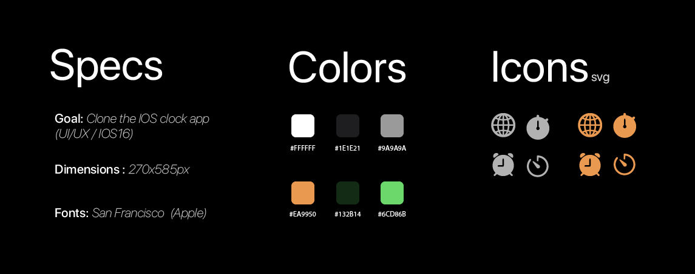

# IOS (16) Clock App in React 

~~NOTE: Development is paused until after exams (June-July)~~
 
The goal of this project is to create an accurate UI/UX clone of the *IOS 16 Clock app* in 2 phases:

1. Phase 1: 
    * Get resources (Icons, Colors, fonts, etc..)
    * Learn and familiarize React's concepts (State Management, Routing, etc..)
    * Piece a working prototype together 

2. Phase 2:
    * Refactor Code
    * Refine UI/UX
    * Make it as accurate as possible

---
Phase 1   
---
 

